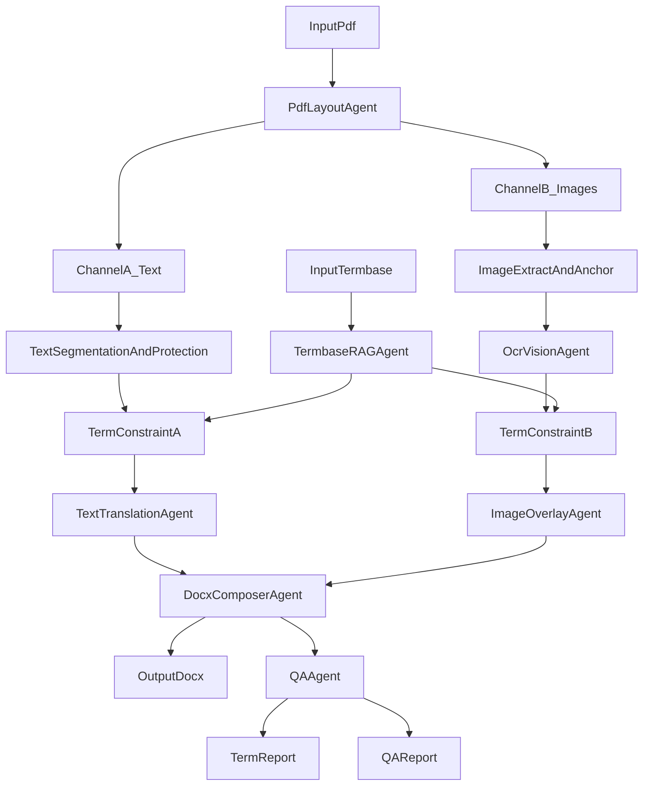

## Background and Goals
- Translate a specified Chinese operation manual PDF into English and deliver a **Word (.docx)** output with formatting as close to the original as possible.
- Enforce enterprise terminology from a private termbase (example: **“????” must be translated as “Robotphoenix”**, and non-standard variants like `yifei intelligent` must be forbidden).
- Support a **replaceable / updatable private termbase**, and ensure translations **synchronize after termbase updates** (prefer incremental re-translation over full reruns).
- The PDF body is mostly copyable text and also contains images; **Chinese text inside images must be translated to English**, preferably **overlaid back onto the original images**.

## Scope and Non-goals
- **In scope**
  - Channel A: copyable PDF text/tables/lists translation + Word layout reconstruction.
  - Channel B: image text extraction (OCR/vision) ? terminology-constrained translation ? English overlay backfill (with a graded fallback).
  - “Three-piece” deliverables: English Word, Terminology Report, QA Report.
  - Allow limited human participation to maximize final quality (e.g., **<5% of images** enter a review/micro-adjust queue).
- **Out of scope**
  - Pixel-perfect reproduction of the PDF (Word and PDF have different layout models); target “structurally consistent + visually close”.
  - Offline-only operation (online/cloud services are allowed).

## Deliverables (“Three-piece Set”)
1. **English Word (.docx)**
   - Reconstruct structure: headings, numbering, tables, image placement, headers/footers (best effort).
   - Image text: prioritize overlay backfill (L1–L3); downgrade to callouts (L4) when needed, with a review list.
2. **Terminology / Proper Noun Report**
   - Split by Channel A / Channel B; Channel B must include overlay grading (L1–L4).
   - Recommended dual formats: Excel (human review) + JSONL (machine/incremental updates).
3. **QA Report**
   - Residual Chinese checklist, terminology consistency stats, number/unit consistency, missing content detection, image overlay success rates and L4 list.

## High-level Architecture (Dual Channel + Merge)

## Multi-agent Roles and Interfaces (Minimum Recommended Set)
- **Orchestrator (workflow/state machine)**
  - Task decomposition, retries, idempotency, concurrency control; global IDs; full traceability per translation unit.
- **PdfLayoutAgent (PDF structure parsing)**
  - Extract page ? blocks (headings/paragraphs/lists/tables/image anchors); preserve reading order and style cues.
- **TermbaseRAGAgent (term retrieval + constraints)**
  - Input: unit text (paragraph/cell/OCR block) + optional domain tags
  - Output: must-use / do-not-use constraints, matched entry IDs, conflict resolution using priority.
- **TextTranslationAgent (body text)**
  - Translate under constraints and protection rules; output alignment (source_unit_id ? translation).
- **OcrVisionAgent (image text extraction)**
  - Output text blocks with confidence, bbox, rotation angle, multi-line grouping and reading order.
- **ImageOverlayAgent (overlay backfill + grading)**
  - Choose L1–L4 based on fit/occlusion risk; output “overlay instructions” (text, geometry, style, z-order).
- **DocxComposerAgent (Word assembly)**
  - Render Channel A to docx; apply Channel B overlays using textboxes/shapes on top of images.
- **QAAgent (quality checks + reports)**
  - Generate terminology report, QA report, and the human review queue (L4 + high-risk items).

## Channel A: Copyable Text/Tables (No OCR Needed)
### Parsing and segmentation
- Infer heading levels from font size/bold/numbering patterns; preserve list numbering.
- Split tables by cells and preserve (row, col) coordinates.

### Protection rules (to avoid mistranslation)
- Protect or rule-translate: paths/commands/code blocks, version strings, IPs, placeholders (e.g., `{x}`, `$VAR`), numbers with units, etc.

### Terminology-constrained translation
- Inject must-use / do-not-use per unit; resolve conflicts by priority.
- Post-check must-use presence; re-translate or enforce replacements if violated.

## Channel B: Image Text (OCR/Vision) + Overlay Grading
### When is OCR required?
- Copyable PDF body text does not require OCR.
- **Chinese text embedded in images** (non-selectable/non-copyable) requires OCR/vision extraction.

### Overlay grading (L1–L4)
- **L1 Direct overlay**: English fits within the original bbox, readable, no overflow, no critical occlusion.
- **L2 Overlay with adaptation**: allow auto wrap / font shrink / minor tracking adjustments.
- **L3 Overlay with bbox expansion**: allow slight expansion without hiding critical graphics.
- **L4 Downgrade to callouts**: overlay is unreliable or occlusion risk is high; add numeric anchors in-image and an English callout area outside.

> Target: maximize L1–L3; allow **<5%** images into L4 review/micro-adjust queue.

### Backfill strategy highlights
- Preserve bbox/rotation from OCR so overlays can rotate accordingly.
- Optionally add background fill/stroke for readability (without destroying original meaning).
- If English is longer: prefer L2 first, then L3, finally L4.

## Enterprise Termbase (RAG) and “Replace/Update ? Sync” Mechanism
### Term entry data model (recommended)
- `entry_id`
- `zh_term` (canonical Chinese)
- `en_term` (canonical English)
- `aliases[]` (ZH/EN aliases)
- `domain_tags[]` (optional)
- `priority` (conflict priority)
- `forbidden_en[]` (explicitly forbidden variants)
- `updated_at`, `entry_hash`

### Traceability and incremental re-translation
For each translation unit (paragraph/cell/OCR block), persist:
- `unit_id`, `unit_type` (paragraph/table_cell/ocr_block)
- `source_text_norm`, `source_hash`
- `termset_version` / `termset_hash`
- `used_entry_ids[]`, `used_entry_hashes[]`
- `translation_text`, `translation_hash`
- Location: page number, paragraph ID / table coords / image ID + bbox

On termbase updates:
- compute changed entries (add/modify/delete)
- reverse-map to impacted units ? **re-translate only impacted units**
- produce an impact report and before/after diffs for review

## Report Specs (Field Recommendations)
### Terminology Report (split by channel)
- **Channel A**: page, paragraph ID / table coords, source snippet, matched terms (entry_id/zh/en/match_type), translation snippet, pass/fail, conflict/missing notes.
- **Channel B**: page, image ID, OCR block bbox/rotation/confidence, OCR source text, matched terms, translation, **overlay_level (L1–L4)**, review queue flag, recommended action.

### QA Report (minimum checklist)
- Residual Chinese scan (docx text + image OCR cross-check)
- Terminology consistency (must-use pass rate, forbidden violations, conflicts)
- Number/unit/symbol consistency (versions, paths, params, units)
- Image overlay stats (L1/L2/L3/L4 ratios, L4 list)
- Missing content detection (by page: paragraphs/tables/images alignment)

## Acceptance Metrics (Recommended)
- **Terminology enforcement**: near-100% must-use compliance; zero forbidden variants.
- **Residual Chinese**: zero residual Chinese except explicitly allowed items with a documented list.
- **Image overlay quality**: L1–L3 meet target ratio (e.g., ?95%); all L4 items are listed and quickly actionable.
- **Layout similarity**: structural parity (headings/tables/image placement) with minor typography differences allowed.

## Risks and Mitigations
- **Complex diagrams / dense small fonts / perspective tilt**: use L4 downgrade and human review queue; prioritize correctness and non-occlusion.
- **English expansion**: use L2 adaptation + L3 expansion + L4 callouts.
- **OCR noise impacting terms**: termbase-assisted correction and low-confidence review.

