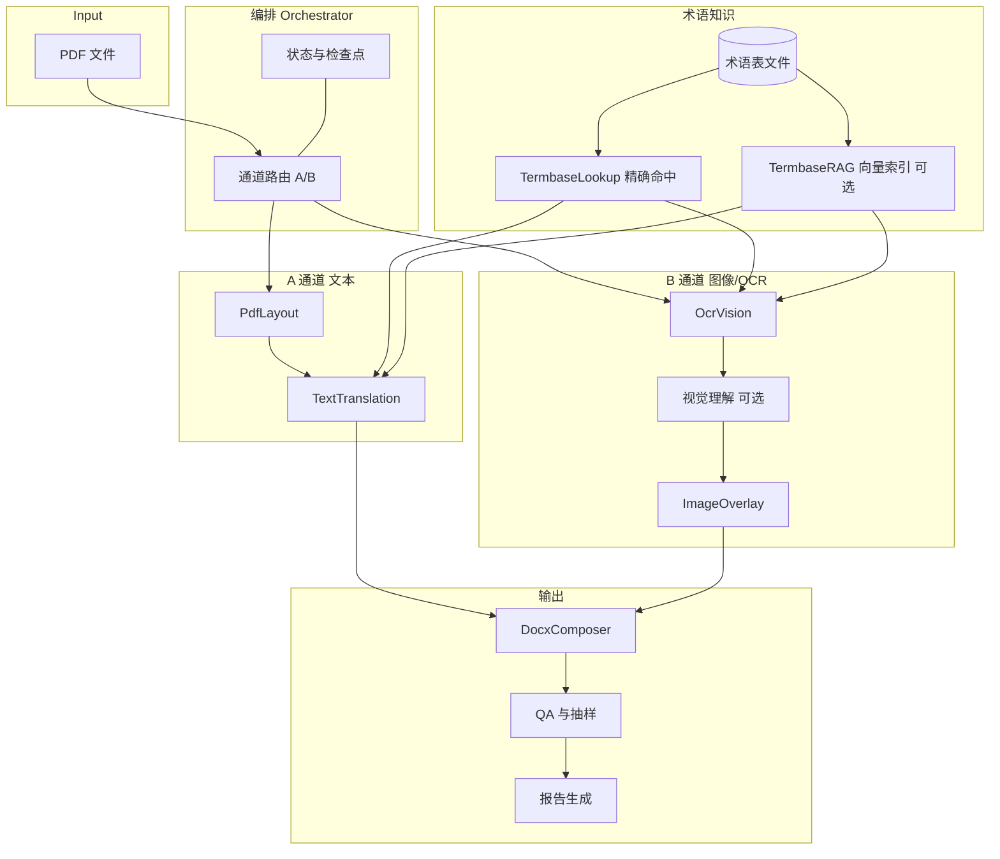

# PDF 多智能体翻译与术语 RAG：方案设计（中文）

本文档从架构与多智能体协作角度描述系统边界、通道划分、叠字层级与术语 RAG；与《实施计划（中文）》配套。

## 目标

- 在 **可复制文本（A 通道）** 与 **图像/扫描（B 通道）** 并存的前提下，提供一致的 **翻译单元（TU）** 抽象与可追溯报告。
- 通过 **多智能体角色分工** 降低单点提示词复杂度，并用 **TermbaseLookup（强约束）+ 可选 TermbaseRAG（候选补召回）** 约束专业表达。
- 输出 **三件交付物**：结构化中间件、**DOCX**、**质检报告**（CSV/HTML）。

## 范围

- **包含**：PDF 解析与版式块切分；中英（可扩展）翻译；OCR；术语检索增强；DOCX 合成；基础 QA 与人工复核队列。
- **不包含（首期）**：复杂桌面出版（InDesign）、法律级逐字比对、全自动版式像素级还原。
- **假设**：客户提供或可构建 **术语表**；密钥通过环境变量注入。

## 三件交付物

1. **结构化中间件**（JSONL/Parquet）：`TranslationUnit`、`OverlayInstruction`、审计字段完整。
2. **DOCX**：便于人工改稿与批注；图片区域遵循 L1–L4 叠字策略。
3. **报告**：术语命中、置信度、QA 标记、**人工复核** 列表。

## 系统架构（Mermaid）

## 多智能体角色（逻辑视图）

| 角色 | 职责 | 典型输入/输出 |
|------|------|----------------|
| **编排者** | 任务分解、A/B 路由、重试与降级 | PDF → 子任务清单 |
| **版式分析** | 块、顺序、bbox | 页渲染/文本块 → `TranslationUnit` 元数据 |
| **术语员** | Lookup 精确命中（强约束）+ RAG 候选补召回（可选） | 源片段 → 术语提示包 |
| **译员（文本）** | A 通道翻译 | 源文+术语 → 译文 |
| **OCR/视觉员** | B 通道识别与元素分类 | 裁剪图 → 文本/类型 |
| **叠字员** | 生成 `OverlayInstruction` | 译文+bbox → L1–L4 指令 |
| **合成员** | DOCX 生成 | TU 列表 → DOCX |
| **质检员** | 规则+模型审校+抽样 | TU/DOCX → `qa_flags`、人工队列 |

> 实现上可为 **单进程多调用** 或 **多进程/消息队列**；逻辑边界以提示词与数据契约为准。
> 落地方式：逻辑上的多智能体分工通过工程模块实现，并由 **LangGraph（M0 起必选）** 承载工作流图与状态机（路由、重试、检查点、回放/增量重跑）。

## 通道 A / B

- **A 通道**：PDF **文本层** 可抽取 → 直接走 `PdfLayout` + `TextTranslation`；术语 RAG 在译前注入。
- **B 通道**：扫描页、插图、文本层不可用块 → `OcrVision`（+ 可选视觉理解）→ `ImageOverlay`；术语 RAG 可对 OCR 结果二次约束。

## 叠字层级 L1–L4（概念）

| 层级 | 策略摘要 | 适用 |
|------|----------|------|
| **L1** | 文本框覆盖（可隐藏原图字） | 简单横幅、对话框 |
| **L2** | 矢量矩形遮罩 + 新文本 | 纯色背景标签 |
| **L3** | 局部修图（inpaint 可选）+ 叠字 | 复杂纹理（慎用成本与伪影） |
| **L4** | 整图替换为「译图」或外链高清图 | 海报级强设计元素 |

默认层级由 `config.yaml` 的 `overlay.level_default` 控制；`QA` 对 L3/L4 执行更高比例抽检。

## 术语库 RAG 与增量更新

- **索引构建**：`TermEntry.source_term`（及同义词）→ 嵌入 → 向量库（本地 Faiss/Chroma 或托管）。
- **检索**：Top-K + 元数据过滤（`domain`）；将命中摘要注入翻译提示词，并要求模型给出 **引用 term_id**（便于报告）。
- **增量更新**：术语表文件变更时，支持 **增量 upsert**（按 `term_id`）与 **定时全量重建**；任务级缓存版本号 `termbase_rev`，写入 `TranslationUnit` 便于回放。

## 报告规格

- **机器可读**：CSV（UTF-8 无 BOM）+ 可选 HTML 仪表盘。
- **必备维度**：页/通道/tu/术语/置信度/QA 标记/耗时/是否人工。
- **图片专项**：列出 bbox 截图路径或哈希、OCR 语言、叠字层级、进入人工原因。

## 验收要点

- A/B 路由与 L1–L4 在黄金样例上行为与设计一致；报告可复现同一 `job_id` 结果（在模型温度固定时）。
- 术语 RAG 更新后，新任务自动携带新 `termbase_rev`；旧任务可据版本复现。
- 全流程文件 **UTF-8 无 BOM**；中文与特殊符号无 `?` 乱码。

## 风险

- 多智能体接口过宽导致 **状态不一致** → 以 `Orchestrator` 单一写出口与幂等 `tu_id` 约束。
- **OCR 误差传播** → B 通道独立 QA；低置信强制人工或二次模型。
- **叠字侵权/风格偏离** → L3/L4 默认关闭或高阈值；客户确认模板。

## UTF-8 编码说明

- 文档、配置、CSV/JSONL 一律 **UTF-8（无 BOM）**；Python 读写显式 `encoding="utf-8"`。
- Windows 下避免依赖控制台默认编码写文件；CI 建议增加「中文fixture round-trip」测试。

---

*文档版本：与仓库同步演进。*
